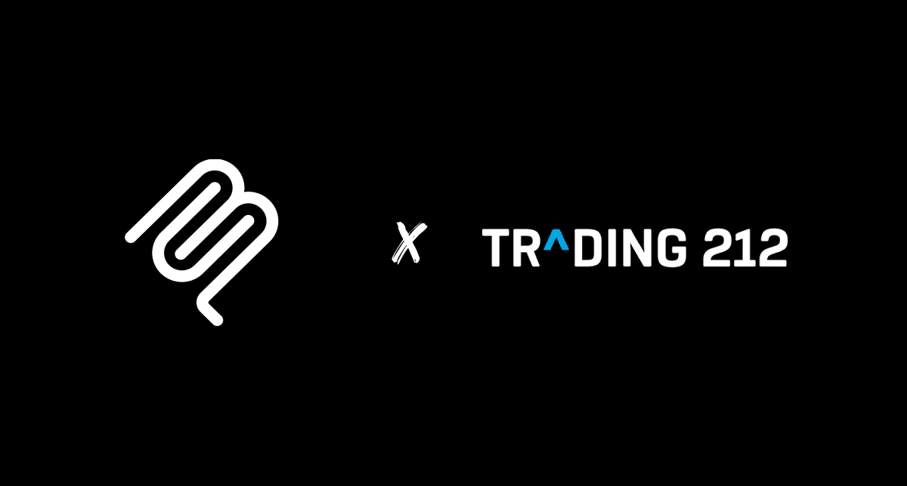

# Trading212 MCP Server

**This is in no way, shape or form affiliated or endorsed by Trading212.**

This is a hobby project so that I can keep up to date with the latest tech. This MCP server will give your LLM capabilities to interact with the Trading212 API.

A few things to note if you choose to run this. The **BASE_API_URL** with in main.py is hardcoded and points to the demo account API. If you want to use your live account **(AT YOUR OWN RISK)** change **"demo"** to **"live"**.

## T212 API Documentation and how to set up your access token

[How To Get API KEY](https://helpcentre.trading212.com/hc/en-us/articles/14584770928157-Trading-212-API-key)
[How To Generate Authentication Token](https://docs.trading212.com/api/section/authentication)
## How to set up environment variables

[See this documentation](https://www.digitalocean.com/community/tutorials/how-to-read-and-set-environmental-and-shell-variables-on-linux)

